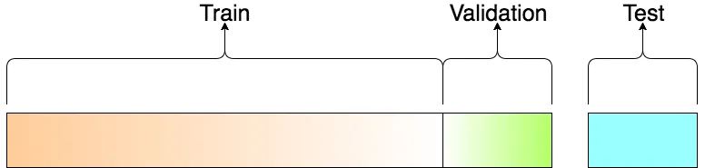
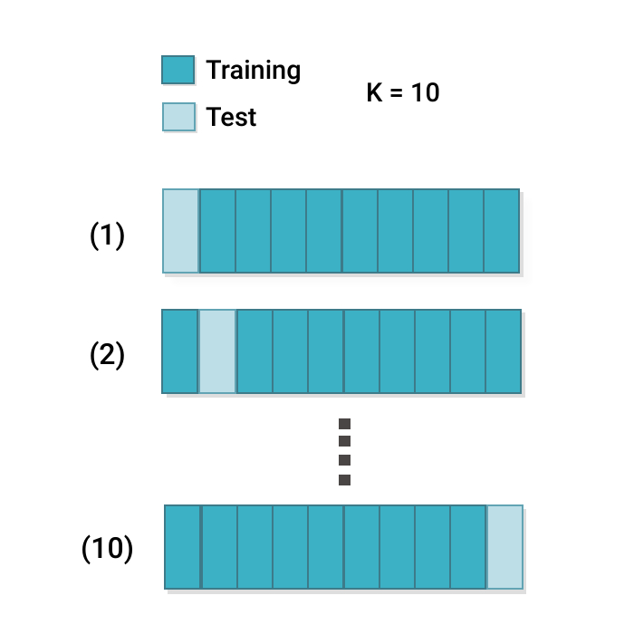
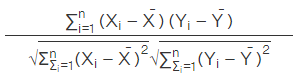
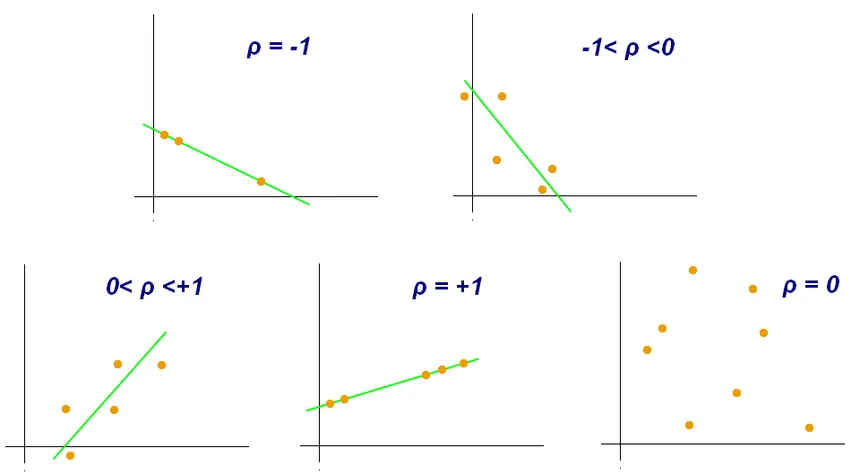

## A. La science des données  
La science des données est la science des structures et algorithmes issues de n'importe quel type de données. Elle est un mélange entre mathématiques, statistiques, informatique et ingénieurie.  
## B. L’apprentissage automatique et/ou l’apprentissage profond  
L'apprentissage automatique (ou Machine Learning) est "le domaine d'étude qui donne le pouvoir aux ordinateurs d'apprendre sans avoir explicitement été programmé" Arthur Samuel, 1959. De manière plus simple c'est la science de la programmation d'ordinateur pour qu'ils puissent apprendre de la donnée.  
L'apprentissage profond (ou Deep Learning) est la partie de l'apprentissage automatique utilisant des réseaux de neuronnes. Cette structure algorithmique d'utilisation de la donnée est issue de modèle mathématique biomimétique conceptualisé par Frank Rosenblatt.  
## C. L’apprentissage supervisé  
L'apprentissage supervisé est une méthode d'apprentissage automatique où le jeux de donnée exploité inclu les solutions désirées, les labels.   
**Exemple :** Dans un modèle d'apprentissage automatique qui essaierai de prédire le prix des maisons à Marseille, on utiliserai de l'apprentissage supervisé si dans le jeux de données, chaque observations contient les informations sur la maisons et aussi le prix. 
## D. L’apprentissage non supervisé  
A l'inverse de l'apprentissage supervisé, l'apprentissage non supervisée est une méthode d'apprentisage automatique où le jeux de donnée exploité n'inclu pas de labels.  
## E. La classification supervisée  
La classification supervisée est la methode de classification utilisant un jeux de donnée labelisé.  
**Exemple :** Dans un modèle d'apprentissage automatique qui essaierai de prédire si un individu est de sexe masculin ou de sexe féminin, on aurait un jeux de données où chaque observations contiendrait des informations sur l'individu mais aussi son sexe. 
## F. La classification non supervisée  
La classification supervisée est la methode de classification utilisant un jeux de donnée non labelisé.
**Exemple :** Dans un modèle d'apprentissage automatique qui essaierai de prédire si un individu est de sexe masculin ou de sexe féminin, on aurait un jeux de données où chaque observations contiendrait des informations sur l'individu mais pas sur son sexe. Ainsi on ferait une classification *binaire* où le modèle décidera de deux groupes par rapprochement.  
## G. La régression  
En statistiques, la régression est la méthode d'analyse visant à rapprocher des variables corrélées à une ligne de régression.  
**Expression mathématiques :** soit y la ligne de régression défini par : ax + b et chaque variables est donc défini par : y + bruit. Une bonne ligne de régression diminue ainsi le bruit pour les variables au maximum.  
En science des données, la régression est une problématique d'apprentissage automatique différente de la classification. En effet, la régression est dans une optique de prédiction d'une variable quantitavie, là ou la classification est d'une variable qualitative (d'un plan sémantique).  
**Exemple :** Dans nos exemples précédents, la prédiction des prix des maisons à Marseille est une problématique de régréssion.
## H. Les données d’entraînement, les données de test et/ ou de validation
Dans l'entraînement d'un modèle d'apprentissage automatique, il est usuel de séparé le jeux de données en trois partis. La première partie, les données d'entraînement, vont être les données exploités par le modèle. Pour estimer la performance du modèle, on pourra comparer les données produites avec les données réels d'une deuxième partie, les données de test. Enfin, pour une utilisation fréquente et variante, il est utile d'avoir une troisième partie, les données de validation, afin d'améliorer au maximum les hyperparmètres du modèle.  
**Exemple :** Dans un jeux de données, je vais créer un modèle de régression sur le prix des fruits et légumes en France. Pour ce faire, je possède un large dataset de 200 000 observations. Je vais mélanger mon jeux de données puis le séparer en deux, de manière à avoir un bloque de 80% du jeux de données (160 000 observations), les données d'entraînement et les 40 000 restantes les données de test. Pour le développement de mon modèle, je vais prendre 1/6 de mes données d'entraînement pour améliorer les hyper paramètres de mon modèle. Une fois entraîné avec mes données d'entraînement (et de validation), je vais évaluer sa performance avec les données de tests. Si les résultats ne me conviennent pas, je vais améliorer le modèle puis re tester avec les données de tests.  
**Schema :**  
  
## I. La validation croisée  
Dans un contexte de données d'entraînement et de test, la validation croisée est une méthode d'évaluation de performance consistant à répeter la validation avec différentes parties de test et d'entraînement.  
Il existe différentes validation croisées afin d'optimiser soit la vitesse d'éxécution, soit la fiabilité de la validation.  
**Exemple :** Dans un jeux de données qu'on sépare en 5, on va répéter 5 vois l'opération suivante. On va prendre le premier 1/5ème du jeux de données pour devenir les données de test et les 4/5ème restante seront les données d'entraînement. Puis on prendra le deuxième 1/5ème du jeux de données qu'on entrainera sur les 4/5ème restantes (le premier 1/5ème et le 3/5ème restant). Et ce jusqu'au dernier 1/5ème.  
**Schema :**  

## J. Corrélation linéaire (de Pearson) entre deux variables  
La corrélation linéaire correspond simplement à la relation entre deux variables. Cette relation s'exprime d'un nombre réel entre -1 et 1, ou 0 marque l'abscence de corrélation, 1 la corréaltion parfaite et -1 une corrélation inverse parfaite.  
**Exemple :** Plus vous codez en python, plus vous progressez en python. Ainsi il existe une corrélation (plus forte selon l'individu) positive entre le temps investi et la compétence.  
**Mathématiques :**   
  
**Sémantique :**  
  
## K. Une fonction de coût  
Une fonction de coût (cost function ou lost function en anglais) est une fonction qui mesure l'écart entre la valeur prédite par un modèle et la valeur réelle. Il existe plusieurs formules pour calculer cet écart.  
## L. La descente de gradient 
La descente de gradient est une méthode d'optimisation de modèle visant à minimiser la fonction de coût. Il existe plusieurs descente de gradient différentes selon le modèle employé.